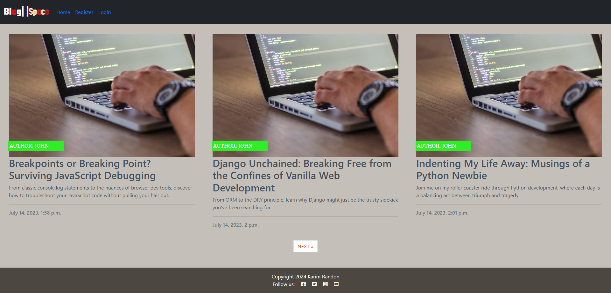
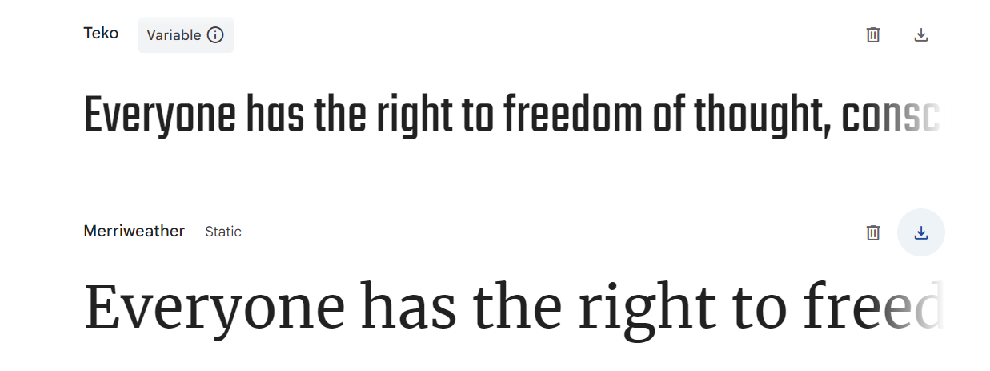
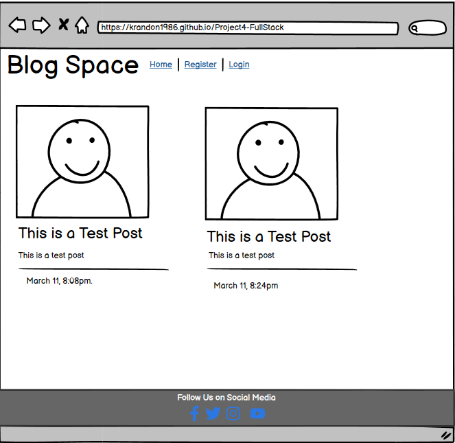
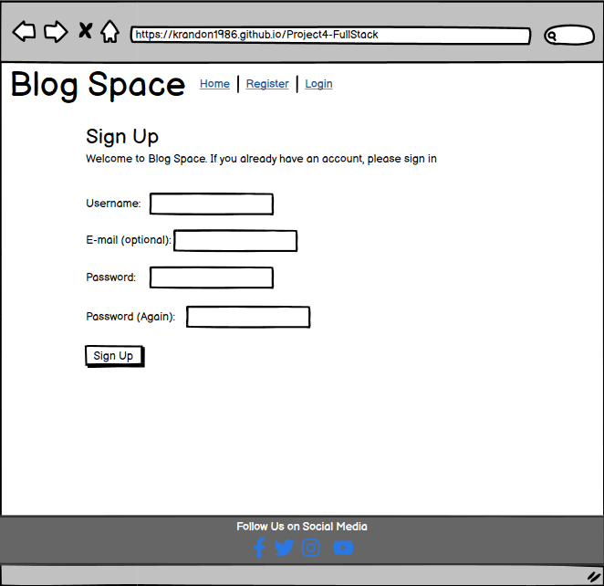
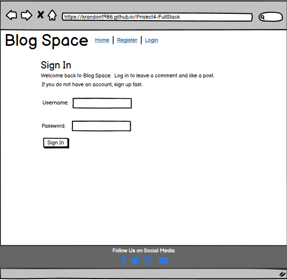
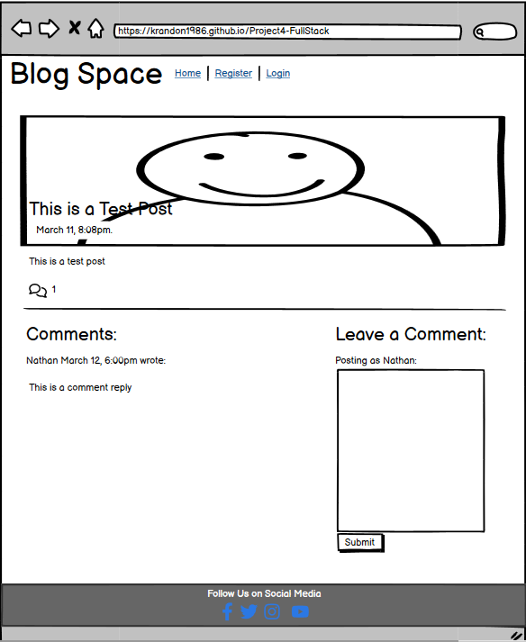
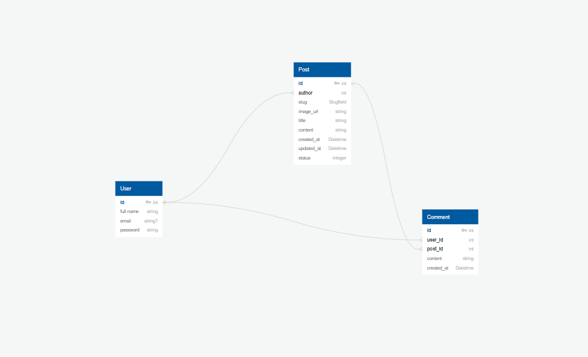
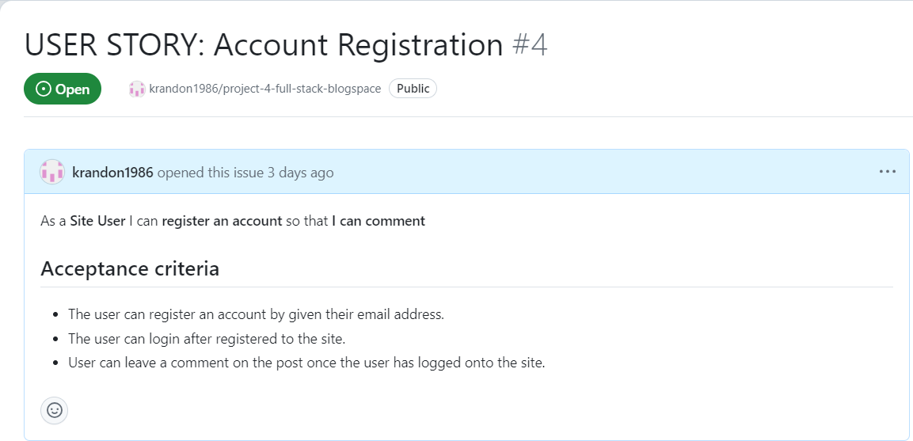
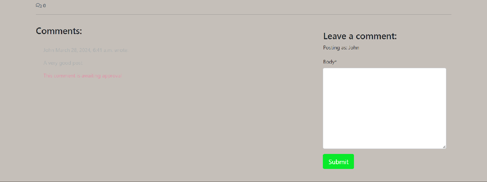

<h1 align="center">Blog Space</h1>

## Description

This is my blog site where I can add a series of post on many different topics. People view them and post comments on each post if they wish. All they need to do is log in post a comment, sign up if they don't have an account on the site.  

The site is live can be access [here](https://blogspace-97bdcd968196.herokuapp.com/)

## Design

- __Color Pallete__
    - The three main colors that is used for this site are Black, Taupe White, and Black Fox.
    - Black color is used for background color for the navigation section.
    - Taupe White is used for the background color for the site.
    - Black Fox is used as the background color for the footer section.

- __Typography__
    - Merriweather google font will be used throughout the main body of blog site, whereas the Teko google font will be used in the headline text. 
    - If the web browser can't render the Merriweather and Teko google fonts, the fonts will fall back to san serif.

- __Wireframe__
    - This is the home page of my blog site.

    

    - This is signup page, where first time user can create an account on the site.

    

    - This is the login page, where returning users can log back into the site. 

    

    - This is post page where the supercar can post articles onto the site. Each post page will have same layout, even when the article are different
    - When login, the user will be able to post comment on the post they are visiting.

    

## Database Diagrams
This is the diagram of what database is going to be stored on my blog site. The database will have three tables, post, user and comments. All three of them will be connected to each other via the foreign key. 

## User Stories
In this section, you will look the user stories that is use to help implement certain feature in the certain part on the site.

To see the full list of the User Stories for BlogSpace, click [here](https://github.com/users/krandon1986/projects/6/views/1)

- __Site Pagination__
    -   First stage of putting features on the site is paginated list of post, so that the site user can select any post to view.

    .png)

    - As you can see from the home page, it is populated with several different posts via the admin using superuser account. A visiting user can select any post and read it. 

    .png)

- __View a Post__
    - With the post created, a visiting user can click on the post to view it. 

    .png)

    - Once the user select of the post, they can read one and if they want leave a comment. 

    .png)

- __View Comments__
    - As with the post, users' comments can be viewed as well. 
    - However, the superuser (admin) can view the posted comments on the Django administation page.

    .png)

    - As a user, they can view post and scroll down to see a posted comment. 

    .png)

    - As an admin, the superuser can view all comment posted on site in Django administration page by clicking comments under 'Blog'.

    .png)

- __Account Registration__
    - Any visiting user that isn't logged into the sit won't be able post comments. So they would have to register an account by given their email address.

    

    - While logged in and click on one of the post, text box will visible to the user so that they can post a comment. 

    .png)

- __Comment on a Post__
    - Users can engaged conversation with each on the post.

    .png)

    - Once user has posted his or her comment, it need to be approved admin before it is allowed to be shown in the comment section. 
    - The only people that can see it before it is approved is the user that post it. 

    

    - Once the comment is approved, the comment visible to everyone.

    .png)

- __Manage Posts__
    - As site Admin, it is important for superuser to be able create, read, update and delete to be about manage the content on the blog site.

    .png)

    - The superuser can gain access all blogs and comment and is able to read, create, update, and delete it from the Django Admin. 

    .png)

    - As the user logged in to the site as a superuser, Blog Post page appear in the navigation bar that will only appear if the user has superuser status. 
    - Under each blog post on the home page, there will be an edit and delete button. These buttons can only be seen by the superuser. 

     

    - As a superuser, they can write a new blog post on the site without going on the site admin page. 

    .png)

    - After finishing, the superuser can post their blog onto the site.

    .png)

    - After posting a new blog, the user is redirected back to the home page where they will receive a success message.

    .png)

    - The new blog that created on the site can be seen at the end of the page of the home page.

    .png) 

    - Inside the new blog post, the edit button and the delete button is also seen on post.

    .png)

    - After clicking the edit button, the user is refered to the edit page that is similar add page.
    - The field boxes will be populated by the post the user wants to update. 

    .png)

    - After adding a second paragraph on the post, the superuser has to put 'p' tag on each paragragh to ensure that there are separated. 

    .png) 

    - Once updated, the user can be redirected the home page with success message, telling the user that blog post has been updated.

    .png)

    - Going onto the blog post that was edited, the user can see the second paragragh was updated by them.

    .png) 

    - To delete the blog post, the user can click the delete button underneath the post they want to get rid of. 

    .png)

    - Once the delete button is click, the user is redirected to the first page of the home page. 
    - A success message will be displayed, telling the user that the blog post is deleted. 

    .png)

    - If the user go back to the final page of the home page, they will find that the blog post is successfully deleted. 

    .png)

- __Modify or Delete Comments__
    - User can edited or delete their comment they have posted.

    .png)

    - By creating the edit button under user's comment and implement the neccesary javascript code to be able to update the posted comments. 

    .png)

    - The user can make some adjustment to the comment before reposting it. 

    .png)

    - After the user updates his comment, message will be displayed at the top of the page, but below the navigation section to inform the user that their comment has bee updated.

    .png)

    - Now the user's comment has been updated.

    .png)

    - After creating the delete button, clicking will cause a popup to open to inform the user that they are about to delete their comments. 

    .png)

    - Like when the user updated his comment, they receive a message telling the user that their comment has successfully being deleted.

    .png)

- __Create Drafts__
    - As a Site Admin, they create draft on the Django admin and save the contrant finish it later. 

    .png)

    - Logged in as superuser, the Admin can create half finished post and save it as a draft. 

    .png)

- __Approve comment__
    - Everytime user post a comment on the site, it doesn't become visible to the public until the admin approves it.

    .png)

    - Looking at post comment via the admin, the approve boolean is left unchecked. which means it is still invisible to public except the user who posted it. 

    .png)

## Testing

- HTML Validator
    - No Errors are found via W3C validator: [Home](https://validator.w3.org/nu/?doc=https%3A%2F%2Fblogspace-97bdcd968196.herokuapp.com%2F)
    - No Errors are found via W3C validator: [Login](https://validator.w3.org/nu/?doc=https%3A%2F%2Fblogspace-97bdcd968196.herokuapp.com%2Faccounts%2Flogin%2F)
    - There are four errors found via W3C validator, which can't be corrected as this page is created by Django: [Register](https://validator.w3.org/nu/?showsource=yes&doc=https%3A%2F%2Fblogspace-97bdcd968196.herokuapp.com%2Faccounts%2Fsignup%2F) 
    - No Errors are found via W3C validator, however there is a warning about a lack of heading in the article class: [Blog Detail](https://validator.w3.org/nu/?doc=https%3A%2F%2Fblogspace-97bdcd968196.herokuapp.com%2Fpost_detail%2Fbreakpoints-or-breaking-point-surviving-javascript-debugging%2F#l81c43)
    - No Errors are found via W3C validator: [Add Blog](https://validator.w3.org/nu/?doc=https%3A%2F%2Fblogspace-97bdcd968196.herokuapp.com%2Fadd%2F)
    - No Errors are found via W3C validator: [Edit Blog](https://validator.w3.org/nu/?doc=https%3A%2F%2Fblogspace-97bdcd968196.herokuapp.com%2Fpost_detail%2Fedit%2Fbreakpoints-or-breaking-point-surviving-javascript-debugging%2F)
    - No Errors are found via W3C validator: [Logoff](https://validator.w3.org/nu/?doc=https%3A%2F%2Fblogspace-97bdcd968196.herokuapp.com%2F)

- CSS Validator
    - There are no errors found on the CSS page, however there are couple of warnings found on the [CSS Validator](https://jigsaw.w3.org/css-validator/validator?uri=https%3A%2F%2Fblogspace-97bdcd968196.herokuapp.com%2F&profile=css3svg&usermedium=all&warning=1&vextwarning=&lang=en). 

- Accessibility

    - The Log-in page score minimum of 88% due to the image elements not having attributes. 
    - The Edit-Blog page scores a minimum of 89% due to links not having discenible names and the heading elements not being in sequentially descending order
    - All the other pages (Home, Register, Blog Detail, Blog Post and Logout) scores around 93%, 94% and 95% due to the background and foreground color not having a sufficent contract ratio.

        - Home Page

            -home.png)

        - Post Page

            _post_page.png)

        - Sign Out

            _signout.png)

        - Sign Up

            _signup.png)

        - Log In

            _login.png)

        - Add Blog

            _add_blog.png)

        - Edit Blog

            _edit_blog.png)

- Mobile Responsiveness
    - The lowest to highest maximum screen width for responsive design was done from 338px to 912px.   
    - Mobile responsiveness was limited to the "toggle device" feature in Chrome Developer Tools due to lack of access to more physical devices.

## Bugs

| Bug | Solution |
| --------------- | --------------- |
| 1. I was unable to delete my posted comment | Spelling error in the code|
| 2. The Add Blog page couldn't be found | In the urls.py, url path for post_detail page was "path('<slug:slug>/', views.post_detail, name='post_detail')" instead of "path('post_detail/<slug:slug>/', views.post_detail, name='post_detail')"
## Deployment
This project was deployed in Heroduk using the Code Institute's terminal.
- Step for deployment:
    - Clone the the blogspace repository.
    - Create a new Heroku app.
    - Name the new Heroku app.
    - Go on setting and click the 'Reveal Config Vars' button.
    - Enter 'PORT' as a key and 8000 as value.
    - Set the buildbacks to 'Python' and 'NodeJS' in that order. 
    - Link the Heroku app to the blogspace repository.
    - Click [Deploy Branch](https://blogspace-97bdcd968196.herokuapp.com/)

## Credit
- The 'I Think therefore I Blog' tutorial is what I use to build my project. 

- General Guidance
    - [Font](https://fonts.google.com/)
    - [Icons](https://fontawesome.com/)
    - [color](https://coolors.co/)